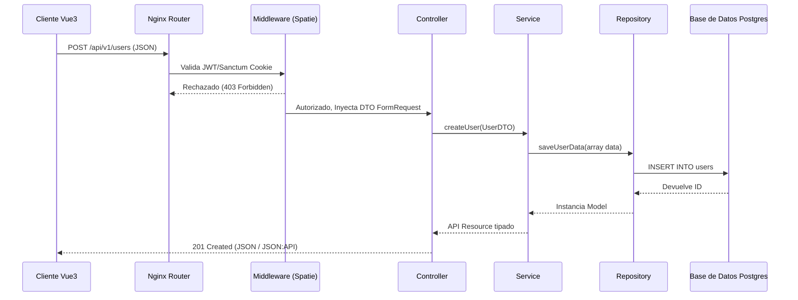

# 1. Arquitectura Detallada y Diagrama de Flujo

Larastack implementa una **Arquitectura Limpia (Clean Architecture)** adaptada a Laravel, separando claramente las responsabilidades en capas.

## Capas del Sistema Backend

1. **Controller (Capa de Presentación):**
   - Su única responsabilidad es recibir el Request HTTP, validarlo delegando a Request/DTOs y retornar una Response JSON (o view).
   - *Nunca* contiene reglas de negocio complejas ni condicionales.

2. **Service (Capa de Negocio):**
   - Contiene la lógica central de la aplicación. Orquesta la interacción entre modelos, repositorios, enrutadores de pago, envío de correos, etc.
   - Es testeable de forma aislada sin levantar la BD necesariamente.

3. **Repository (Capa de Acceso a Datos):**
   - Abstrae la base de datos (Eloquent ORM / Query Builder). El servicio no sabe *cómo* se guardan los datos o de qué tabla viene.

4. **DTO (Data Transfer Objects):**
   - Objetos inmutables que transportan datos estructurados y estrictamente tipados entre Controllers y Services, evitando los `arrays` asociativos inseguros que no proveen autocompletado en el IDE de PHP.

## Diagrama de Flujo de Petición HTTP (Mermaid)

