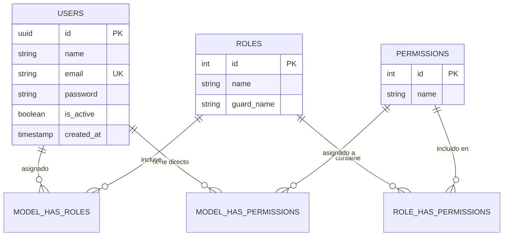

# 2. Modelo de Base de Datos y Relaciones

Larastack utiliza un diseño preparado para PostgreSQL 17, permitiendo el uso extensivo de `UUID` y claves foráneas puras. Se basa en el paquete `Spatie Laravel Permission` para autorizaciones.

## Tablas Principales

### `users`
- `id` (uuid / BIGSERIAL, PK)
- `name` (varchar 255)
- `email` (varchar 255, UNIQUE)
- `password` (varchar 255, HASHED via Bcrypt/Argon2id)
- `is_active` (boolean, default true)
- `created_by` (uuid, FK self users) -> Indica auditoria simple, quién creó a este usuario.
- `created_at`, `updated_at`, `deleted_at`

### Tablas RBAC (Spatie Laravel Permission)
- `roles` (id, name, guard_name, timestamps)
- `permissions` (id, name, guard_name, timestamps)
- `model_has_roles` (role_id, model_type, model_id) -> Relaciona un Agente/User con Roles.
- `model_has_permissions` -> Permisos directos asignados a un Model.
- `role_has_permissions` -> Permisos atados a Roles (lo recomendado).

## Diagrama Entidad-Relación

